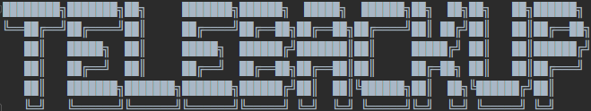

>Backup to telegram your sites archive

## Install

```shell
git clone https://github.com/rasperepodvipodvert/telebackup.git
cd telebackup
```

Create `config.py` and past your data from: https://my.telegram.org/apps

```ini
api_id = '5195065'
api_hash = 'f933114319f9a650f669e91ccf995165'

session_name = 'bkp_bot'    # custom id for you
user_name = 'me'            # who resive your backup
file_path = 'readme.md'     # path to backup file
caption = ''                # caption for file
```

Create venv

```shell
apt install python3-venv        # if need
python3 -m venv venv
venv\Scripts\activate           # windows
source venv/bin/activate        # linux
pip install -r requirements.txt
```

## How to use

```shell
python3 main.py -u "@ifilatov" -f "./readme.md"
```

## Fetches

- Upload more than 50mb

## TODO

- Split large files
- ~~comandline args~~